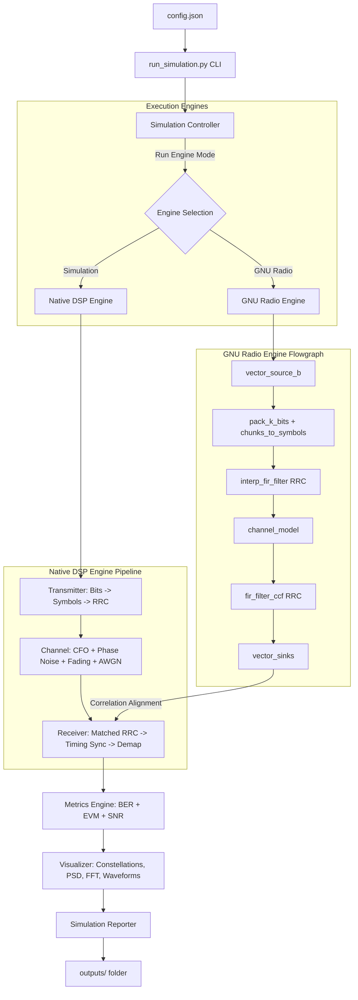

# 📡 SDRLab

### A Modular, Configuration-Driven Software Defined Radio Simulation & DSP Validation Framework

<div align="center">

[](https://www.python.org/)
[](https://www.gnuradio.org/)
[](https://streamlit.io/)
[](LICENSE)
[](tests/)
[](https://github.com/AayushMandhar/SDRLab)
[](https://github.com/AayushMandhar/SDRLab/commits/main)

<br>

[🚀 Live Demo Website](https://sdrlab-6simscefsovrckwg2dkddb.streamlit.app/) • [📂 GitHub Repository](https://github.com/AayushMandhar/SDRLab)

<br>


<p align="center"><em>Figure 1: SDRLab Streamlit Dashboard Landing Page.</em></p>

</div>

---

## ⚡ Quick Start

Get SDRLab up and running on your local machine in under two minutes:

```bash
# 1. Clone the repository
git clone https://github.com/AayushMandhar/SDRLab.git
cd SDRLab

# 2. Install package dependencies
pip install -r requirements.txt

# 3. Launch the Streamlit Interactive Dashboard
streamlit run streamlit_app/app.py

# 4. Or run the headless CLI Simulation Sweep
python run_simulation.py
```

---

## 📖 Project Overview

**SDRLab** is a modular, configuration-driven software engineering platform designed to simulate, analyze, and compare baseband digital wireless communication systems. By merging Python's scientific computing stack with programmatic GNU Radio bindings, it provides an industrial-grade engineering workbench to evaluate digital modulations, synchronizers, and channel impairments.

Historically, wireless communication simulations are built inside monolithic, hardware-specific, or poorly structured script files, making them hard to scale, test, or integrate into CI/CD pipelines. **SDRLab** bridges the gap between software engineering and software-defined radio (SDR) by decoupling the core DSP algorithms from the configuration, orchestration, metrics computation, and visualization layers.

---

## 🌟 Project Highlights

- ✔ **Dual Execution Engine** – Seamlessly switch between a native NumPy/SciPy DSP simulator and a programmatic GNU Radio block-based engine.
- ✔ **GNU Radio Integration** – Programmatic, execution-based flowgraphs building on compiled C++ blocks (`pack_k_bits_bb`, `chunks_to_symbols_bc`, `interp_fir_filter_ccf`).
- ✔ **Native Python DSP** – A pure Python fallback engine that enables full simulation runs on any system without GNU Radio installed (perfect for CI/CD).
- ✔ **Interactive Streamlit Dashboard** – A user-friendly web interface for running real-time simulations, adjusting parameters, and viewing dynamic sweeps.
- ✔ **Configuration-Driven Design** – Control the simulation entirely using a structured, schema-validated JSON configuration file.
- ✔ **Plugin Architecture** – Easily add higher-order modulation schemes through an extensible, registry-based base modulator plugin class.
- ✔ **Automated BER Analysis** – Calculates and plots empirical Bit Error Rate (BER) curves directly against theoretical AWGN limits.
- ✔ **Professional Reporting** – Compiles performance data, configurations, and generated plots into clean, shareable Markdown reports.

---

## ✨ Key Features

| Category | Description & Implemented Features |
| :--- | :--- |
| **Sim Engines** | Dual-mode execution featuring native NumPy/SciPy DSP and GNU Radio 3.10 block chaining. |
| **DSP Core** | Bit generation, RRC pulse shaping, matched filtering, timing delay correlation sync, and symbol demapping. |
| **Channel Model** | Simulation of physical impairments including AWGN, Carrier Frequency Offset (CFO), Phase Noise, and Multipath fading. |
| **Analysis** | Real-time computation of empirical Bit Error Rate (BER), theoretical limits, and Error Vector Magnitude (EVM). |
| **User Interface** | Interactive Streamlit web app showing live parameter tuning, parameter sweeps, and diagnostic plots. |
| **CLI & Controller** | Advanced command-line runner supporting config overrides, engine selections, headless run modes, and automatic logging. |
| **Unit Testing** | Fully-tested suite consisting of 15 unit and integration tests covering mathematical formulas and engine operations. |
| **Documentation** | Extensive README, developer instructions, contributing guides, security policies, and technical STAR stories. |

---

## 🌐 Live Demo & Exploration

The interactive dashboard is deployed and accessible at:
- **Streamlit Live Website**: [SDRLab Interactive Dashboard](https://sdrlab-6simscefsovrckwg2dkddb.streamlit.app/)
- **GitHub Code Repository**: [SDRLab GitHub Page](https://github.com/AayushMandhar/SDRLab)

### What you can explore:
- **Interactive Sweeps**: Select modulation schemes, adjust SNR ranges, and execute simulations on the fly.
- **Impairment Tuning**: Dial in Carrier Frequency Offset (CFO), Phase Noise, or Multipath taps and instantly view the constellation degradation.
- **Metrics Dashboard**: View calculated EVM (RMS %), empirical BER, and download complete CSV tables and PDF reports.
- **About Framework**: Read developer details and review code execution architecture directly in the web app.

---

## 📊 Repository Metrics

| Parameter | Specifications |
| :--- | :--- |
| **Language** | Python 3.8+ |
| **Frameworks** | GNU Radio 3.10+ / Streamlit 1.20+ |
| **Simulation Modes** | Programmatic GNU Radio (`flowgraph.py`) or Native Python DSP fallback |
| **Supported Modulations**| BPSK, QPSK (Extensible to 16-QAM/64-QAM) |
| **Verification Suite** | 15/15 unit and integration tests passing (`unittest`) |
| **License Type** | MIT Open-Source |

---

## 🛠 Technology Stack

SDRLab leverages a modern scientific Python stack combined with industrial SDR tooling:

| Technology | Logo | Primary Role inside SDRLab |
| :--- | :---: | :--- |
| **Python 3.8+** |  | Main programming language, OOP core, and test suite. |
| **GNU Radio 3.10**|  | compiled C++ DSP blocks and programmatic flowgraph orchestration. |
| **NumPy** |  | Baseband sample matrices, math utilities, and upsampling. |
| **SciPy** |  | Root-Raised-Cosine (RRC) filtering and erfc mathematical functions. |
| **Pandas** |  | Sweep data tabulation, CSV output structuring, and log analytics. |
| **Matplotlib** |  | Headless plot generation (constellations, PSD, BER sweeps). |
| **Streamlit** |  | Interactive dashboard web app, UI elements, and input bindings. |

---

## 🏗 Software Architecture

SDRLab is designed with a decoupled architecture that separates parameters, control flow, DSP engines, metrics, and visual interfaces.



### Component Breakdown
1. **Configuration (`config.json` & `config.py`)**: Acts as the validated, single source of truth for runtime parameters, establishing strict schema limits for sample rates, excess bandwidth, and impairments.
2. **Controller (`controller.py`)**: The sweep orchestrator that sets up loop schedules, manages runtime resources, and coordinates cross-correlation synchronization to align transmitted and received bit arrays.
3. **Execution Engines (`dsp/` & `gnuradio/`)**: Decoupled modules implementing the actual signal processing:
   - *Native Engine*: Implements transmitter upsampling, shaping, impairments, and receiver matched filtering using NumPy array slices.
   - *GNU Radio Engine*: Programmatically compiles a C++ block flowgraph, executes the blocks inside an ephemeral thread, and streams sample buffers back via vector sinks.
4. **Metrics (`metrics.py`)**: Computes quantitative statistics such as empirical Bit Error Rate (BER), theoretical limits via Q-functions, and Error Vector Magnitude (EVM) values.
5. **Visualization (`visualizer.py`)**: A headless drawing utility generating high-resolution Matplotlib figures representing constellations, power spectral density, time signals, and sweeps.
6. **Reporting (`reports.py`)**: Composes comprehensive Markdown reports linking generated figures and exporting CSV data tables to the `outputs/` folder.

---

## 📁 Repository Structure

```text
SDRLab/
│
├── README.md                      # Project manual and architectural guide
├── LICENSE                        # MIT License
├── requirements.txt               # Declared package dependencies
├── config.json                    # Default simulation configuration file
├── run_simulation.py              # CLI controller entry script
├── .gitignore                     # Git ignore rules
│
├── sdrlab/                        # Core Library Package
│   ├── __init__.py
│   ├── config.py                  # SimulationConfig validation manager
│   ├── logger.py                  # Structured logger with file-lock release handlers
│   ├── controller.py              # Sweep orchestrator & cross-correlation sync
│   ├── metrics.py                 # Empirical/Theoretical BER, EVM, SNR calculators
│   ├── visualizer.py              # Plotting utilities (constellations, PSD, BER)
│   ├── reports.py                 # Markdown performance report compiler
│   │
│   ├── dsp/                       # Pure Python/NumPy DSP Subpackage
│   │   ├── __init__.py
│   │   ├── modulator.py           # Extensible Modulator Plugins (BPSK/QPSK)
│   │   ├── transmitter.py         # Bit generation, upsampling, RRC pulse shaping
│   │   ├── channel.py             # CFO, phase noise, multi-tap fading, AWGN channels
│   │   ├── synchronization.py     # Base interfaces for carrier/timing sync, Ideal Sync
│   │   ├── receiver.py            # Matched filter, timing peak slicing, demapping
│   │   └── utils.py               # Filter coefficient design helpers (RRC generator)
│   │
│   └── gnuradio/                  # GNU Radio Subpackage
│       ├── __init__.py
│       ├── flowgraph.py           # Programmatic gr.top_block assembly
│       └── sdrlab_simulation.grc  # GRC Companion flowchart design
│
├── streamlit_app/                 # Streamlit Web Frontend Package
│   ├── app.py                     # Main dashboard UI entry point
│   ├── components/                # Modular UI widgets (sidebar components)
│   ├── views/                     # Multi-page dashboard render modules
│   ├── utils/                     # Dashboard simulation runner utilities
│   └── assets/                    # Static dashboard media assets
│
├── examples/                      # Developer usage examples
│   ├── __init__.py
│   ├── basic_run.py               # Programmatic single point simulation API example
│   └── snr_sweep_example.py       # Programmatic sweep simulation API example
│
├── tests/                         # Unit & Integration Test Suite
│   ├── __init__.py
│   ├── test_config.py             # Schema parsing and validation boundary checks
│   ├── test_dsp.py                # Modulator, filter energy, and pipeline recovery tests
│   ├── test_metrics.py            # BER, SNR, EVM logic validation
│   └── test_controller.py         # Micro-simulation sweep integration tests
│
└── docs/                          # Project Documentation
    ├── assets/                    # Copied dashboard and result screenshots
    └── internship_prep.md         # Resume templates, STAR stories, and Q&A guides
```

---

## ⚙ Execution Workflow

1. **Configuration Initialization**: The controller reads `config.json` and parses inputs through `SimulationConfig`, running schema constraints.
2. **Sweep Scheduling**: The `SimulationController` schedules the run loops over the specified modulation schemes (e.g., BPSK, QPSK) and SNR ranges (e.g., 0 dB to 12 dB).
3. **DSP Execution**:
   - *Native Engine*: Bits are generated, mapped to symbols, upsampled, shaped with a Root-Raised-Cosine (RRC) filter, passed through the channel impairment block, matched-filtered, timing-synchronized, and demapped.
   - *GNU Radio Engine*: A parallel thread spawns a programmatic flowgraph. Data streams through compiled C++ blocks and is piped back using vector sinks.
4. **Synchronization and Alignment**: Since matched filtering and downsampling introduce group delays, the receiver uses cross-correlation peak-finding algorithms to align the output symbols with the original transmitted symbols.
5. **Metrics Computation**: Empirical BER is measured by counting discrepancies, EVM is computed from symbol distance, and theoretical BER is calculated for reference.
6. **Visual and Tabular Reporting**: Headless Matplotlib workers plot results, Pandas exports a CSV table, and a Markdown report is compiled to the disk.

---

## 🖥 Dashboard Showcase

The interactive Streamlit dashboard is structured into individual views. Below is a gallery of the primary dashboard sections:

<div align="center">

| Section | Screenshot | Description |
| :--- | :--- | :--- |
| **Landing Page** |  | Introductory portal providing access to the simulator, project information, and core details. |
| **Results View** |  | Real-time parameter sweep plotter showing empirical results vs. theoretical performance curves. |
| **Constellation View** |  | Diagnostic constellation plots displaying signal scattering at different channel SNR steps. |
| **Waveform View** |  | Baseband I/Q signal tracks in the time-domain, contrasting transmitted shapes against noisy outputs. |

</div>

---

## 📈 Simulation Results Gallery

The simulation outputs diagnostic plots to help developers debug DSP algorithms and verify communication math. Below are the key results generated during a simulation sweep:

<div align="center">
<table>
  <tr>
    <td align="center"><b>Bit Error Rate (BER) waterfall curve</b></td>
    <td align="center"><b>Carrier Power Spectral Density (PSD)</b></td>
  </tr>
  <tr>
    <td></td>
    <td></td>
  </tr>
  <tr>
    <td>Empirical BPSK and QPSK sweep curves running side-by-side and matching theoretical AWGN limit lines.</td>
    <td>Welch periodogram displaying spectral containment, main lobe roll-off, and side lobe attenuation.</td>
  </tr>
  <tr>
    <td align="center"><b>Constellation Analysis (6 dB SNR)</b></td>
    <td align="center"><b>Constellation Analysis (0 dB SNR)</b></td>
  </tr>
  <tr>
    <td></td>
    <td></td>
  </tr>
  <tr>
    <td>Ideal transmitter symbols compared against channel-corrupted symbols and final receiver-recovered points.</td>
    <td>Heavy AWGN channel distortion showing overlapping decision boundaries prior to final synchronization.</td>
  </tr>
  <tr>
    <td align="center"><b>Time-Domain Waveforms</b></td>
    <td align="center"><b>Dashboard Analysis Interface</b></td>
  </tr>
  <tr>
    <td></td>
    <td></td>
  </tr>
  <tr>
    <td>Filtered baseband I (In-phase) and Q (Quadrature) signals showing shaping effects and noisy channel outputs.</td>
    <td>The unified frontend running real-time simulation sweeps and generating analytical reports.</td>
  </tr>
</table>
</div>

---

## 🔌 GNU Radio Integration

SDRLab features a dual-engine architecture to ensure portability while supporting standard SDR toolsets.

### 1. Simulation Engine (Native)
A pure Python/NumPy DSP engine designed to run independently of any hardware or third-party frameworks. It executes matrix operations for RRC filter convolution, introduces channel impairments analytically, and recovers bits via mathematical constellation slicing.

### 2. GNU Radio Engine
When enabled, SDRLab programmatically constructs a GNU Radio flowgraph (`gr.top_block`). It routes signals using compiled C++ blocks inside the GNU Radio environment. Data is piped from Python memory buffers into `vector_source_b`, processed through standard filters and channels, and captured via `vector_sink_c`.

### 3. Fallback Logic
Because installing GNU Radio can be complex on target operating systems, SDRLab implements graceful **Fallback Logic**:
- At startup, the framework checks for `gnuradio` package availability.
- If missing, it prints a diagnostic logger warning: `[WARNING] GNU Radio not found. Falling back to Native Simulation Engine.`
- It updates the active configuration engine value from `"auto"` (or `"gnuradio"`) to `"simulation"`, preventing script failures and enabling headless CI/CD runs.

---

## 💎 Software Engineering Highlights

SDRLab is a **Software Engineering project** built on SDR principles. It prioritizes clean architecture, robust testing, and standard engineering design patterns:

- 🧱 **Modular Architecture**: Signal stages (Transmitter, Channel, Receiver, Synchronizer) are isolated, single-responsibility modules.
- 🎨 **Plugin Architecture**: Adding new modulations (e.g., 16-QAM) only requires inheriting from `BaseModulator` and adding it to the registry. The core controller and visualizer remain unchanged.
- 📐 **Object-Oriented Design (OOD)**: DSP blocks, visualizers, and managers are written as decoupled classes, ensuring clean, testable interfaces.
- ⚖ **Separation of Concerns**: DSP engines process samples, visualizers generate plots, and report modules format text. There is no mixing of logic.
- ⚙ **Configuration-Driven Design**: The runtime environment is controlled via `config.json`. Schemas are validated on start to check parameter bounds and prevent arithmetic errors.
- 📝 **Robust Logging**: Replaces unformatted print statements with thread-safe, multi-level file and console loggers that gracefully release file handles.
- 🧪 **High Testability**: Decoupled modules allow for focused unit testing of DSP math, configuration constraints, and file operations.
- 🚀 **Scale and Reusability**: The core engine runs headlessly inside command lines, containers, or web apps, allowing developers to reuse components across different setups.

---

## 💾 Installation

### Prerequisites
- **Python**: Version 3.8 or higher.
- **GNU Radio**: (Optional) GNU Radio 3.10.x. If not installed, SDRLab automatically falls back to native simulation mode.

### Windows / macOS / Linux Setup
```bash
# Clone the repository
git clone https://github.com/AayushMandhar/SDRLab.git
cd SDRLab

# Create a virtual environment
python -m venv venv

# Activate the virtual environment
# On Windows:
venv\Scripts\activate
# On macOS/Linux:
source venv/bin/activate

# Install required dependencies
pip install -r requirements.txt
```

---

## 🚀 Detailed Usage

SDRLab provides flexible interfaces for running sweeps and single simulations:

### 1. Headless CLI Simulations
Execute simulations directly from the command line using configurations:

```bash
# Run a sweep with default parameters from config.json
python run_simulation.py

# Force execution using the native Python/NumPy simulation engine
python run_simulation.py --engine simulation

# Force execution using the GNU Radio engine
python run_simulation.py --engine gnuradio

# Specify a custom config file path
python run_simulation.py --config custom_config.json

# Run sweeps headlessly and skip plot rendering (saving execution time)
python run_simulation.py --no-plot
```

### 2. Running Programmatic Code Examples
Examples are provided in the `examples/` directory to show how to import SDRLab as a library:

```bash
# Run a simple BPSK single-point simulation
python examples/basic_run.py

# Programmatically build and execute an SNR sweep
python examples/snr_sweep_example.py
```

### 3. Launching the Interactive Web Dashboard
Run the Streamlit frontend locally:

```bash
streamlit run streamlit_app/app.py
```

---

## 💻 Streamlit Dashboard Details

The Streamlit web interface makes it easy to visualize how parameters affect signal propagation:

- **Sidebar Configuration**: Adjust sample rates, excess bandwidth, symbol counts, and select the modulation engine in real time.
- **Impairments Panel**: Tune sliders for CFO (Hz), Phase Noise variance, and select multipath channel taps.
- **KPI Metrics Cards**: View real-time measurements of processed bits, elapsed runtimes, and average EVM (%).
- **Interactive Plot Tabs**: Review BER curves, PSD roll-off, time waveforms, and constellation groupings.
- **Export Utility**: Download raw tabulated CSV data and PDF summaries of the sweep directly from the browser.

---

## 📂 Generated Outputs

All simulations export structured results to the `outputs/` directory:

- **`outputs/logs/simulation.log`**: Step-by-step logs, performance runtimes, and fallback warnings.
- **`outputs/csv/sweep_results.csv`**: Tabulated values for SNR, Modulation, EVM, and empirical vs. theoretical BER.
- **`outputs/plots/ber_vs_snr.png`**: Composite BER sweep chart.
- **`outputs/figures/`**: Folder containing individual constellations, waveforms, and PSD plots at checkpoint SNRs.
- **`outputs/reports/simulation_report.md`**: Fully-formatted Markdown report compiling configuration, results, and referencing plots.

---

## 🧪 Testing Suite

SDRLab features a robust unit and integration test suite with **15/15 tests passing**. The test coverage checks the integrity of the math and structure:

```bash
# Run all tests using the unittest runner
python -m unittest discover -s tests -p "test_*.py"
```

### Test Suite Structure
- `test_config.py`: Verifies configuration parsing, range limits, and boundary error handling.
- `test_dsp.py`: Asserts modulator mapping, filter gains, and symbol sequence recoveries.
- `test_metrics.py`: Validates BER calculations, Q-function math, and EVM formulas.
- `test_controller.py`: Performs integration tests running quick simulation sweeps.

---

## 🗺 Roadmap

### Completed (V1.0 & V1.1)
- [x] Dual-engine simulation core (Simulation vs. GNU Radio).
- [x] Extensible Modulator Plugin system.
- [x] Channel impairments model (CFO, Phase Noise, Multipath Fading, AWGN).
- [x] Timing alignment via cross-correlation synchronization.
- [x] Automated CSV compilation and Markdown report generator.
- [x] Interactive Streamlit visual sweep dashboard.
- [x] Multi-platform support and Windows file lock resolution.

### In Progress
- [ ] 16-QAM and 64-QAM modulator registry plugins.
- [ ] Gardner timing recovery loops for arbitrary timing offsets.
- [ ] Costas Loop carrier frequency and phase synchronization tracking.

### Planned (V2.0)
- [ ] RTL-SDR and USRP hardware source/sink block integrations.
- [ ] Over-the-air (OTA) RF spectrum sweep captures.
- [ ] OFDM modulation engine support.
- [ ] AI-assisted optimization for adaptive coding and modulation (ACM).

---

## 🔮 Future Scope

The development path for SDRLab focuses on migrating from software simulations to real-world RF hardware testing:

- **Higher-Order Modulations**: Adding 16-QAM, 64-QAM, and M-PSK plugins using the modular base registry.
- **Closed-Loop Synchronization**: Implementing continuous timing/phase recovery loops (Gardner/Costas Loops) to replace ideal correlation synchronization.
- **Hardware Integration**: Integrating RTL-SDR and USRP devices directly into the GNU Radio engine to process real RF signals.
- **OFDM Systems**: Expanding the pipeline to support Orthogonal Frequency Division Multiplexing.
- **AI Optimization**: Employing machine learning models to dynamically optimize modulation and coding schemes based on fading channel profiles.

---

## 🤝 Contributing

Contributions are welcome! If you want to add new modulations, channel models, or recovery loops:
1. Fork the repository.
2. Read the guidelines in [CONTRIBUTING.md](CONTRIBUTING.md).
3. Create a feature branch and commit your changes.
4. Open a Pull Request detailing your changes and confirming that the test suite passes.

---

## 📄 License

This project is licensed under the MIT License. See the [LICENSE](LICENSE) file for details.

---

## 💖 Acknowledgements

- **GNU Radio Project**: For providing the core digital signal processing blocks.
- **Scientific Python Community**: For maintaining NumPy, SciPy, Pandas, and Matplotlib.
- **Streamlit Community**: For making rapid web application deployment simple.
