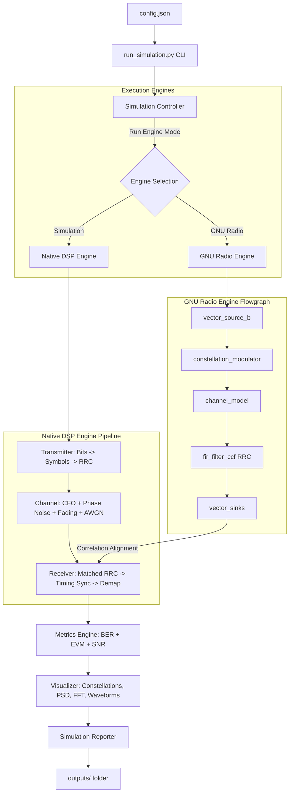

# SDRLab: A Python-Based Configurable Wireless Communication Simulation Framework using GNU Radio

SDRLab is a modular, production-ready software platform designed to simulate, analyze, and validate digital wireless communication systems. By combining Python’s scientific processing stack (**NumPy**, **SciPy**, **Pandas**, **Matplotlib**) with **GNU Radio**, the framework provides a configuration-driven dual-engine simulation pipeline suitable for testing SDR concepts in both standard development environments and physical hardware setups.

---

## 1. Key Architectural Overview

SDRLab implements a **dual-execution engine design** to guarantee absolute portability and testability:
- **Simulation Engine**: A pure Python/NumPy implementation of the core DSP pipeline, ideal for headless servers, CI/CD systems, IDE units, or environments lacking a GNU Radio installation.
- **GNU Radio Engine**: The primary SDR implementation utilizing standard GNU Radio C++ blocks wrapped programmatically in Python (`gr`, `digital`, `channels`, etc.).

Both engines are fed by the same configuration schemas, and their output waveforms undergo the exact same matched filtering, symbol timing peak extraction, and constellation measurements—enabling mathematically rigorous comparisons.

### System Architecture Flow



---

## 2. Directory Structure

```
sdrlab/
│
├── README.md                      # Project manual and architectural documentation
├── LICENSE                        # MIT License
├── requirements.txt               # Dependencies listing (NumPy, SciPy, Matplotlib, Pandas)
├── config.json                    # Default simulation settings (taps, offsets, SNR ranges)
├── run_simulation.py              # CLI controller entry script
│
├── sdrlab/                        # Main Library Core Package
│   ├── __init__.py
│   ├── config.py                  # SimulationConfig loader & validation schema
│   ├── logger.py                  # Structured console & file logging
│   ├── controller.py              # Sweep orchestrator & correlation alignment
│   ├── metrics.py                 # Empirical/Theoretical BER, EVM, SNR calculators
│   ├── visualizer.py              # Visualizations generator (Time, FFT, PSD, Constellations)
│   ├── reports.py                 # Markdown performance report generator
│   │
│   ├── dsp/                       # Pure Python/NumPy DSP Subpackage
│   │   ├── __init__.py
│   │   ├── modulator.py           # Plugin Modulators (BaseModulator -> BPSK, QPSK)
│   │   ├── transmitter.py         # Bit generation, upsampling, RRC pulse shaping
│   │   ├── channel.py             # CFO, phase noise, multi-tap fading, AWGN channel
│   │   ├── synchronization.py     # Base interfaces for carrier/timing sync, Ideal Sync
│   │   ├── receiver.py            # Matched filter, timing peak slicing, demapping
│   │   └── utils.py               # Filter coefficient design helpers (RRC generator)
│   │
│   └── gnuradio/                  # GNU Radio Subpackage
│       ├── __init__.py
│       ├── flowgraph.py           # Programmatic gr.top_block assembly
│       └── sdrlab_simulation.grc  # GRC Companion flowchart design
│
├── examples/                      # Developer usage examples
│   ├── __init__.py
│   ├── basic_run.py               # Run single point simulation programmatic example
│   └── snr_sweep_example.py       # Run sweep simulation programmatic example
│
└── tests/                         # Unit & Integration Test Suite
    ├── __init__.py
    ├── test_config.py             # Schema parsing and validation boundary checks
    ├── test_dsp.py                # Modulator math, filter energy & pipeline recovery tests
    ├── test_metrics.py            # BER, SNR, EVM logic validation
    └── test_controller.py         # Micro-simulation sweep integration tests
```

---

## 3. Installation

### Prerequisites
1. **Python 3.8+**
2. **GNU Radio (Optional)**: Install via system package manager (e.g. `sudo apt install gnuradio` on Linux/Ubuntu or standard installer on Windows). If GNU Radio is not present, SDRLab will print a warning and run the native Simulation Engine.

### Setup Instructions
Clone the repository (or copy it to your workspace) and install python dependencies:

```bash
# Navigate to the project root directory
cd sdrlab

# Install dependencies
pip install -r requirements.txt
```

---

## 4. Execution Guide

SDRLab provides a flexible command line interface.

### Running standard sweeps
Run a full sweep over BPSK and QPSK formats utilizing parameters from `config.json` with auto-detected engine:
```bash
python run_simulation.py
```

### Forcing a specific engine backend
Run the sweep using the pure-Python DSP simulation engine:
```bash
python run_simulation.py --engine simulation
```

Run the sweep using the GNU Radio flowgraph backend:
```bash
python run_simulation.py --engine gnuradio
```

### Specifying custom configurations
Run simulation using a custom settings file:
```bash
python run_simulation.py --config my_custom_config.json
```

### Toggling visual outputs
Force disable plots generation to run faster:
```bash
python run_simulation.py --no-plot
```

Force disable markdown report generation:
```bash
python run_simulation.py --no-report
```

---

## 5. Output Organization

All output files are automatically organized and placed inside the configured output directory (default: `outputs/`):

- **`outputs/logs/`**: `simulation.log` containing all step timestamps, configurations, and errors.
- **`outputs/csv/`**: `sweep_results.csv` containing raw performance data.
- **`outputs/plots/`**: Global plots, such as the `ber_vs_snr.png` curve comparison.
- **`outputs/figures/`**: Detailed time waveforms, PSD spectra, and constellation comparisons for configured SNR checkpoints.
- **`outputs/reports/`**: `simulation_report.md` - the complete Markdown report referencing and linking all assets and results.

---

## 6. Running Tests

SDRLab contains a complete, robust suite of unit and integration tests. Run tests via Python's standard `unittest` framework:

```bash
python -m unittest discover -s tests -p "test_*.py"
```

---

## 7. Version 2 Roadmap

- **16-QAM and 64-QAM plugins**: Subclass `BaseModulator` inside `sdrlab/dsp/modulator.py` to add higher-order constellations without changing execution controller modules.
- **Costas Loop Integration**: Implement a phase-locked loop (PLL) in `sdrlab/dsp/synchronization.py` implementing `BaseCarrierSynchronizer` to track phase drift dynamically.
- **Gardner Timing Recovery**: Implement timing error detectors (TED) to sync symbols with arbitrary fractional timing offsets.
- **Hardware Integration**: Extend the GNU Radio engine to interface directly with USRP, RTL-SDR, or HackRF source/sink blocks.

---

## 8. License

This project is licensed under the MIT License - see the [LICENSE](LICENSE) file for details.
