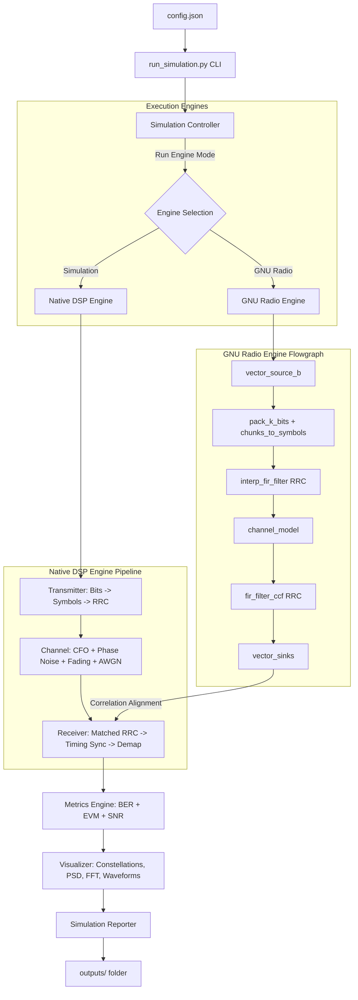

# SDRLab

### A Python-Based Configurable Wireless Communication Simulation Framework using GNU Radio

[](https://www.python.org/)
[](https://www.gnuradio.org/)
[](LICENSE)
[](tests/)

**SDRLab** is a modular, configuration-driven software platform designed to simulate, analyze, and compare digital wireless communication systems. By combining Python's scientific processing stack with GNU Radio bindings, it provides an industrial-grade engineering tool to evaluate baseband DSP algorithms under physical channel impairments.

---

### Core Highlights
*   **GNU Radio 3.10 Integration** – Programmatic gr.top_block flowgraphs built using compiled C++ blocks.
*   **Portable Native Simulation Engine** – A pure Python/NumPy DSP fallback engine for CI/CD and systems without GNU Radio.
*   **Modular Plugin Architecture** – Dynamic, registry-based modulator plugin interface (BPSK & QPSK).
*   **Automated Metrics Pipeline** – Calculation of empirical vs. theoretical BER, EVM (RMS %), and SNR.
*   **Configuration-Driven Executions** – Schema-validated JSON parameters controlling sweeps and impairments.
*   **Professional Reporting** – Automated Matplotlib visual rendering and Markdown report compiling.
*   **Production Test Suite** – 15 unit and integration tests verifying configurations, DSP math, and controllers.

---

## 2. Project Overview

Wireless communication systems are historically simulated inside monolithic, hardware-specific, or poorly structured script files. This makes it difficult to scale, test, or port DSP pipelines. 

**SDRLab** solves this by separating the DSP execution engine from the configuration, orchestration, metrics, and visualization layers. It serves as a bridge for Software Engineers and Software-Defined Radio (SDR) developers. The framework allows users to run sweeps, introduce impairments (such as Carrier Frequency Offset, Phase Noise, and Multipath fading), and generate comprehensive validation reports via a clean CLI interface.

---

## 3. Why This Project?

SDRLab serves as a portfolio piece showcasing how **Software Engineering principles** can be applied to the complex mathematical domain of Software-Defined Radio:

*   **Modular Design**: Every stage of the signal pipeline (Transmitter, Channel, Receiver, Synchronizer) is written as an isolated, single-responsibility module.
*   **Separation of Concerns**: The DSP engines are responsible *only* for processing samples. The visualizer is responsible *only* for generating plots. The reporter is responsible *only* for assembling Markdown text.
*   **Reusable Components**: Custom-designed RRC filters, timing delay correlation finders, and constellation mapping algorithms are built as independent, callable DSP utilities.
*   **Configuration Management**: The entire simulation runs from `config.json`, which acts as a validated, single source of truth for runtime execution.
*   **Automation**: Sweep execution over multiple modulation formats and noise ranges is fully automated, removing the need for manual script configuration.
*   **Structured Logging**: Replaces standard print statements with a thread-safe, multi-level file and console logger that automatically cleans up Windows file locks.
*   **Automated Verification**: Comprehensive unit testing validates configuration limits, DSP calculations, and sweep controller flows before execution.

---

## 4. Key Features

| Category | Implemented Features |
| :--- | :--- |
| **Simulation** | Pure Python/NumPy DSP transmitter, channel impairments, matched filtering, and receiver demapping. |
| **GNU Radio** | Programmatic block chaining (`pack_k_bits_bb`, `chunks_to_symbols_bc`, `interp_fir_filter_ccf`) compatible with GNU Radio 3.10.12. |
| **Analysis** | Real-time calculation of empirical BER, theoretical AWGN limits, EVM (RMS %), and signal/noise power ratios. |
| **Reporting** | Automated generation of Markdown performance reports linking to swept CSV data and figures. |
| **CLI** | Flexible commands supporting configuration selections, engine overrides, and visual output toggles. |
| **Configuration** | JSON-based settings with robust validation checks for limits, bounds, and ranges. |
| **Testing** | 15 unit and integration tests validating config schemas, DSP math, and execution. |
| **Documentation** | Technical README, contributing guides, security guidelines, and interview prep documents. |

---

## 5. Technology Stack

| Technology | Role inside SDRLab |
| :--- | :--- |
| **Python 3.8+** | Core programming language. |
| **GNU Radio 3.10** | C++ DSP blocks, top_block flowgraph builder, and GRC visualization. |
| **NumPy** | Array manipulations, upsampling, convolution, and baseband math. |
| **SciPy** | RRC filtering algorithms and erfc-based theoretical BER computations. |
| **Pandas** | Tabulation, data accumulation, and CSV exporting of sweep metrics. |
| **Matplotlib** | Headless (`Agg` backend) plotting of constellations, PSDs, and sweeps. |
| **JSON** | Configuration schema representation. |
| **Git & Markdown** | Version control, documentation, and reporting format. |

---

## 6. Repository Structure

```text
SDRLab/
│
├── README.md                      # Project manual and architectural guide
├── LICENSE                        # MIT License
├── requirements.txt               # Declared package dependencies
├── config.json                    # Default simulation configuration file
├── run_simulation.py              # CLI controller entry script
├── .gitignore                     # Git ignore rules
│
├── sdrlab/                        # Core Library Package
│   ├── __init__.py
│   ├── config.py                  # SimulationConfig validation manager
│   ├── logger.py                  # Structured logger with file-lock release handlers
│   ├── controller.py              # Sweep orchestrator & cross-correlation sync
│   ├── metrics.py                 # Empirical/Theoretical BER, EVM, SNR calculators
│   ├── visualizer.py              # Plotting utilities (constellations, PSD, BER)
│   ├── reports.py                 # Markdown performance report compiler
│   │
│   ├── dsp/                       # Pure Python/NumPy DSP Subpackage
│   │   ├── __init__.py
│   │   ├── modulator.py           # Extensible Modulator Plugins (BPSK/QPSK)
│   │   ├── transmitter.py         # Bit generation, upsampling, RRC pulse shaping
│   │   ├── channel.py             # CFO, phase noise, multi-tap fading, AWGN channels
│   │   ├── synchronization.py     # Base interfaces for carrier/timing sync, Ideal Sync
│   │   ├── receiver.py            # Matched filter, timing peak slicing, demapping
│   │   └── utils.py               # Filter coefficient design helpers (RRC generator)
│   │
│   └── gnuradio/                  # GNU Radio Subpackage
│       ├── __init__.py
│       ├── flowgraph.py           # Programmatic gr.top_block assembly
│       └── sdrlab_simulation.grc  # GRC Companion flowchart design
│
├── streamlit_app/                 # Streamlit Web Frontend Package
│   ├── app.py                     # Main dashboard UI entry point
│   ├── components/                # Modular UI widgets (sidebar components)
│   ├── utils/                     # Dashboard simulation runner utilities
│   └── assets/                    # Static dashboard media assets
│
├── examples/                      # Developer usage examples
│   ├── __init__.py
│   ├── basic_run.py               # Programmatic single point simulation API example
│   └── snr_sweep_example.py       # Programmatic sweep simulation API example
│
├── tests/                         # Unit & Integration Test Suite
│   ├── __init__.py
│   ├── test_config.py             # Schema parsing and validation boundary checks
│   ├── test_dsp.py                # Modulator, filter energy, and pipeline recovery tests
│   ├── test_metrics.py            # BER, SNR, EVM logic validation
│   └── test_controller.py         # Micro-simulation sweep integration tests
│
└── docs/                          # Project Documentation
    └── internship_prep.md         # Resume templates, STAR stories, and Q&A guides
```

---

## 7. Architecture Diagram



---

## 8. Execution Workflow

1.  **Configuration**: The CLI parses `config.json` (or CLI flags) into a validated `SimulationConfig` object.
2.  **Controller**: The `SimulationController` orchestrates the execution flow for each modulation and SNR step.
3.  **Simulation**:
    *   *Native Engine*: Signal passes through the NumPy baseband modules.
    *   *GNU Radio Engine*: Programmatic flowgraph connects C++ blocks, runs them, and pipes outputs back.
4.  **Metrics**: Symbols are aligned using cross-correlation delay finders. Empirical BER, theoretical limits, EVM, and power values are calculated.
5.  **Visualization**: The `SDRLabVisualizer` renders time-domain, frequency-domain, and constellation graphs.
6.  **Reports**: The `SimulationReporter` exports metrics to a CSV file and compiles the final Markdown report.

---

## 9. Installation

### Prerequisites
*   **Python**: Version 3.8 or higher.
*   **GNU Radio**: (Optional but recommended) GNU Radio 3.10.x. If not present, the framework will gracefully log a warning and run in `simulation` engine fallback mode.

### Setup Instructions
Clone the repository and install the required dependencies:

```bash
# Clone the repository
git clone https://github.com/yourusername/SDRLab.git
cd SDRLab

# Install python packages
pip install -r requirements.txt
```

---

## 10. Usage

Run simulations using the central CLI script:

```bash
# Run a sweep with default parameters from config.json
python run_simulation.py

# Force execution using the pure-Python DSP simulation engine
python run_simulation.py --engine simulation

# Force execution using the GNU Radio engine
python run_simulation.py --engine gnuradio

# Run simulation using a custom configuration file
python run_simulation.py --config custom_config.json

# Run simulation sweeps and bypass plotting to save execution time
python run_simulation.py --no-plot
```

To run the unit test suite:
```bash
python -m unittest discover -s tests -p "test_*.py"
```

To run programmatic examples directly using the library API:
```bash
python examples/basic_run.py
python examples/snr_sweep_example.py
```

### Running the Streamlit Dashboard

SDRLab provides an interactive Streamlit dashboard. Start the local dashboard with:
```bash
streamlit run streamlit_app/app.py
```

---

## 11. Configuration

The simulation runs from parameters defined in [config.json](file:///C:/Users/SLIM%205/.gemini/antigravity/scratch/sdrlab/config.json). Key parameters include:

```json
{
  "engine": "auto",                    // "auto", "simulation", or "gnuradio"
  "num_bits": 40000,                   // Number of bits to simulate per run
  "sample_rate": 1000000,              // Sample rate in Hz
  "sps": 4,                            // Samples per symbol (oversampling)
  "excess_bw": 0.35,                   // RRC roll-off factor (alpha)
  "filter_span": 8,                    // Filter span in symbols
  "modulations": ["BPSK", "QPSK"],     // Modulations to sweep
  "snr_db_range": {
    "start": 0.0,
    "stop": 12.0,
    "step": 2.0
  },
  "channel_impairments": {
    "cfo_hz": 0.0,                     // Carrier Frequency Offset in Hz
    "phase_noise_var": 0.0,            // Phase noise variance
    "multipath_taps": [1.0, 0.2, 0.05] // Multipath channel filter taps
  },
  "outputs": {
    "output_dir": "outputs",
    "generate_plots": true,
    "generate_reports": true
  }
}
```

---

## 12. Generated Outputs

All results are exported to the directory specified under `"output_dir"` (default: `outputs/`):

*   **`outputs/logs/simulation.log`** – Step execution logs, configurations, and errors.
*   **`outputs/csv/sweep_results.csv`** – Tabulated empirical metrics.
*   **`outputs/plots/ber_vs_snr.png`** – Consolidated BER waterfall curve comparing results with theoretical limits.
*   **`outputs/figures/`** – Detailed time waveforms, PSD spectra, and constellation plots for specific SNR checkpoints.
*   **`outputs/reports/simulation_report.md`** – Compiled performance report linking to all visual assets.

---

## 13. Screenshots Section

Below are placeholders for the plots generated during the sweep. 

### Bit Error Rate (BER) Waterfall Curve
*Shows empirical sweeps plotted against theoretical limits.*

*(Reference: outputs/plots/ber_vs_snr.png)*

### Constellation Comparison
*Ideal transmit symbols, channel output with noise dispersion, and post-synchronization recovered symbols.*

*(Reference: outputs/figures/QPSK_constellation_snr_6.png)*

### Power Spectral Density (PSD)
*Welch periodogram displaying spectral roll-off and noise floors.*

*(Reference: outputs/figures/QPSK_psd_snr_6.png)*

### Time-Domain Waveforms
*Snippet displaying I/Q signals and received noisy shapes.*

*(Reference: outputs/figures/QPSK_waveform_snr_6.png)*

---

## 14. Software Engineering Highlights

*   **Plugin Modulator Registry**: Adding higher-order modulations (e.g., 16-QAM) only requires creating a subclass of `BaseModulator` and registering it. Downstream orchestration remains unaffected.
*   **Loose Coupling**: Clean boundary definitions prevent DSP components from referencing GUI libraries, enabling headless, server-side execution.
*   **Automatic Fallback Logic**: Checks for GNU Radio dependencies at runtime and gracefully logs warnings while falling back to in-memory NumPy computations.
*   **Strict Memory Cleanup**: Implementations of logger shutdown hooks prevent files from staying locked, resolving file access errors on Windows.

---

## 15. Current Limitations

*   **Roadmap Scope** – Version 1.0 supports BPSK and QPSK formats. Higher-order formats are planned for the next release.
*   **Synchronization Assumptions** – Symbol timing synchronization assumes stationary timing offsets. It uses cross-correlation based on filter group delay rather than continuous feedback tracking loops (e.g., Gardner loop).
*   **Hardware Interface** – The GNU Radio block engine is simulation-focused. It does not interface directly with physical SDR frontends (e.g., USRP or RTL-SDR).

---

## 16. Roadmap

### [V1.0] - Completed
- [x] Dual-engine simulation backend (Simulation vs. GNU Radio).
- [x] Modulator plugin system.
- [x] CFO, phase noise, fading, and AWGN channels.
- [x] Cross-correlation peak timing synchronization.
- [x] Automated report generation.

### [V1.1] - Completed
- [x] Interactive Streamlit visual sweep dashboard.
- [x] Sibling relative paths and Windows resource leak resolutions.

### [V1.2] - Planned
- [ ] 16-QAM and 64-QAM modulator plugins.
- [ ] Gardner timing recovery loops for arbitrary fractional symbol timing offsets.
- [ ] Phase tracking loops (Costas Loop carrier synchronizer).

### [V2.0] - Planned
- [ ] RTL-SDR and USRP hardware source block integrations.
- [ ] Real RF spectrum capture.

---

## 17. Contributing

Contributions are welcome! Please review the contribution guidelines in [CONTRIBUTING.md](CONTRIBUTING.md) to learn how to add modulator plugins or new synchronization loops.

---

## 18. License

This project is licensed under the MIT License - see the [LICENSE](LICENSE) file for details.

---

## 19. Acknowledgements

*   **GNU Radio** – For providing the open-source toolkit that forms the primary backend engine of this project.
*   **SciPy and NumPy Ecosystem** – For enabling the portable math calculations that make headless native simulations possible.
